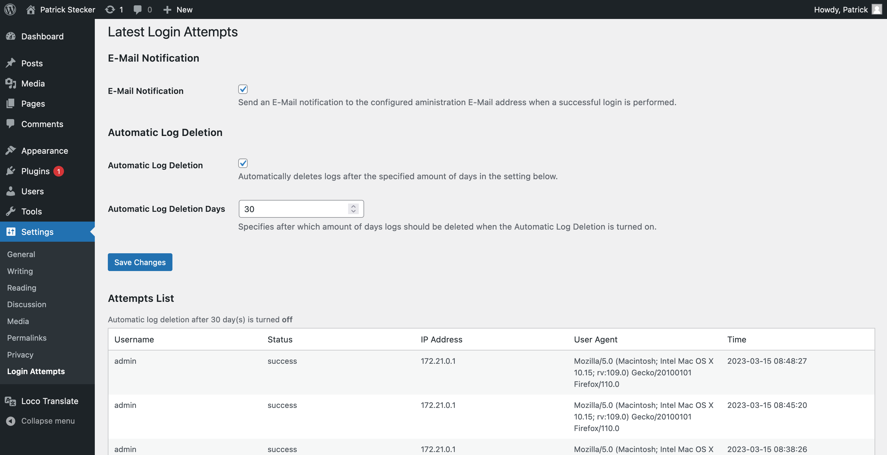

# Login Attempts Logger
This Wordpress Plugin logs all login attempts and displays it on a settings page. It is secured against several potential attacks like SQL injections, XSS attacks, File inclusion attacks, brute force attacks, ...  

---
## How to install
1. Download the latest release as a ZIP file.
2. Log into your wordpress site with your admin user and go to *`Plugins -> add New`* and click the button *`Upload Plugin`*.
3. On this page, select the ZIP file you downloaded in step 1 and follow through the installation progress.
4. When the installation was successful, don't forget to activate the plugin.  

## How to use
After you have installed and activated the plugin, it starts to log all login requests. It doesn't show log ins that happened before the plugin was activated.  
To see the login attempts follow these steps:  
1. Log into your wordpress site with your admin user
2. In your site's backend, navigate to *`Settings -> Login Attempts`*
3. On this page you can see all login attempts since the plugin was activated. It should simular to this:  
